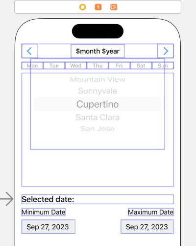
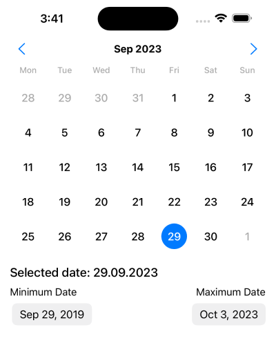
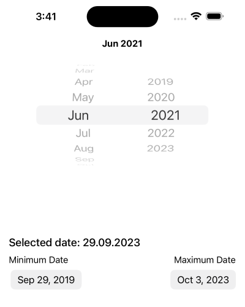

# Custom Date Picker in Swift UIKit

## Description
This is a custom date picker built in Swift UIKit. It is a simple date picker that allows you to select a date. It is built using a `CollectionView` and `CollectionViewCell` to display the days of the month and a `PickerView` to display the months and years.

 In the custom `DateService` class, it makes all the calculations needed. It calculates the number of days in the month and the first day of the month, months and years for the `PickerView` according to the minimum and maximum dates.

You can set the minimum and maximum dates that can be selected. It also has a delegate method that returns the selected date. You can select a month and year and go to the next or previous month. You can also select a day and go to the next or previous month. The `CollectionView` is updated according to the selected month and year.

## Preview

| Storyboard | Preview..... | Preview..... |
| :-: | :-: | :-: |
 |  |  | 

## License

This project is licensed under the MIT License - see the [LICENSE](https://github.com/recepsenoglu/CustomDatePickerIOS/blob/main/LICENSE) file for details.
